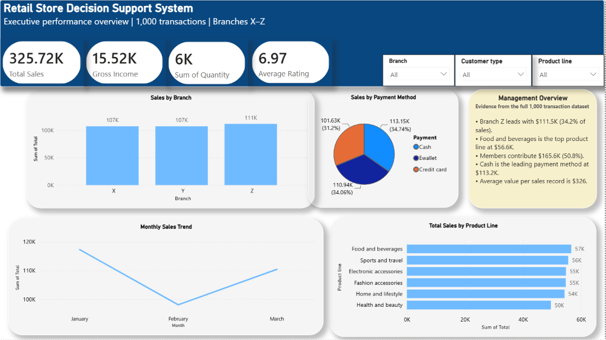
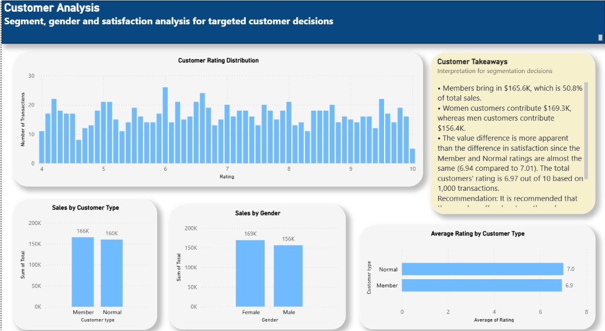
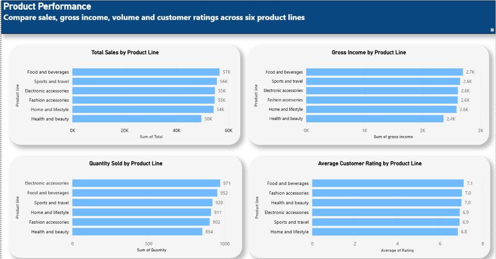
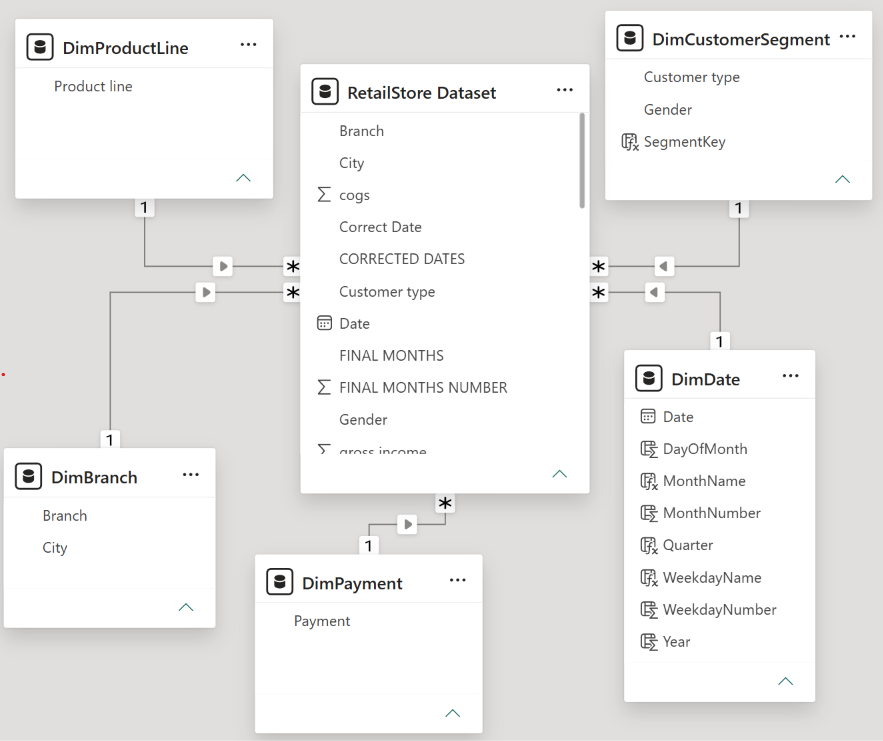
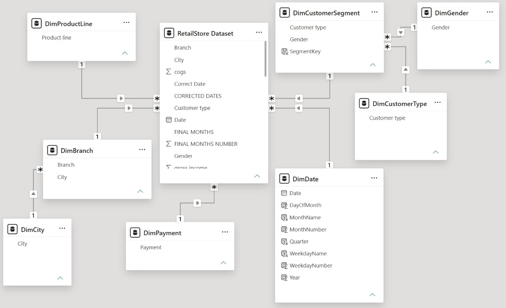
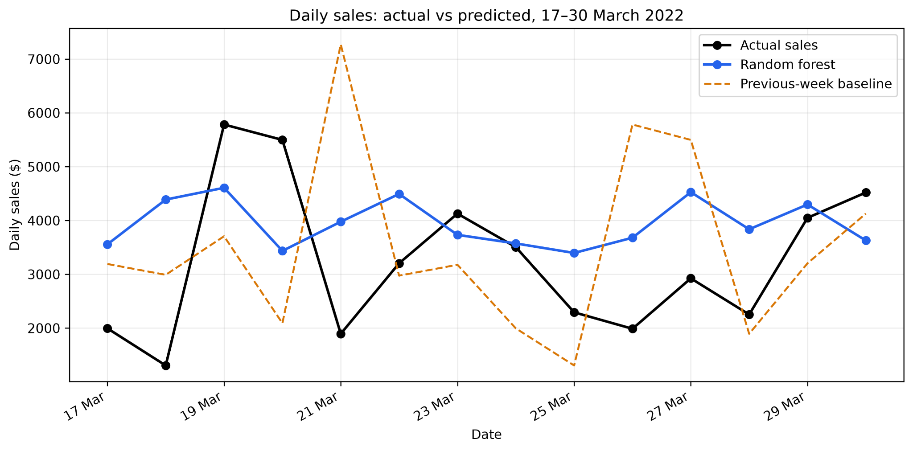

# Retail Business Intelligence & Demand Forecasting

**Power BI · Python · Scikit-learn · Dimensional Modelling · Forecast Evaluation**

An end-to-end *academic portfolio case study* combining retail performance dashboards, star/snowflake data-model prototypes, a proposed BI architecture, and an evaluated one-day-ahead sales forecasting model.

**[Read the two-page project case study (PDF)](docs/Project_Case_Study.pdf)** — a concise overview of the challenge, dashboards, architecture and forecast results.

> **Project scope:** Power BI dashboards and the star/snowflake models were created, and the Python forecast was tested. The enterprise warehouse, automated ETL/POS pipeline, scheduled refresh, access controls, and forecast integration into Power BI are **proposed architecture**, **not deployed features**.

## Business question

How can managers compare retail sales across branches, products, customers, and dates—and use recent daily sales to support short-term planning?

## Project at a glance

| Area | What was done |
|---|---|
| Dataset | 1,000 transaction records, 3 branches (X, Y, Z), 6 product lines; 1 Jan–30 Mar 2022 |
| Analytics | Power BI views for branch, product, customer, payment, and monthly sales |
| Data modelling | Working Power BI star and snowflake comparison models |
| Forecasting | Random Forest regression using lagged sales and day-of-week features |
| Validation | Chronological train/test split, 14-day evaluation versus previous-week baseline |
| System design | Proposed staging → validation/ETL → warehouse → Power BI reporting architecture |

**Important:** The figures below describe the *original coursework dataset* and are not outputs from the separate synthetic sample data included for runnable demonstrations.

## Dashboard previews



<details>
<summary>More dashboard views</summary>

**Customer analysis**



**Product analysis**



</details>

## Key insights from the original analysis

- **Total tax-inclusive sales:** **$325,721.75** across 1,000 transaction records.
- **Highest-sales branch:** Z, with **$111,484.21** from **328** records, versus 340 records for X. Z's average recorded sale was **$339.89**.
- **Highest-selling product line:** Food and beverages, **$56,620.84**. These data describe sales, not inventory availability or profitability.
- **Monthly sales:** January **$117,274.37**; February **$98,046.37**; March **$110,401.01**. Since February has fewer days, average daily sales should also be compared.
- The dataset's field labelled **`gross income` represents tax, not net profit**; it should not be presented as profitability.

These descriptive findings do not establish *why* the observed differences occurred.

## Data modelling: star versus snowflake

| Star schema prototype | Snowflake schema prototype |
|---|---|
|  |  |

The reporting fact table is connected to Date, Branch, Product Line, Payment, and Customer Segment dimensions. The snowflake prototype additionally separates lookup attributes including City, Gender and Customer Type.

**Recommendation:** A **star schema** is more straightforward for this small reporting dataset because it presents fewer lookup paths to dashboard authors. This is a design judgement, **not a measured performance benchmark**. See [Architecture and modelling](docs/architecture.md).

## Forecasting: measured results

The original notebook used four features: `DayOfWeek`, `SalesYesterday`, `SalesLastWeek`, and `AvgPrior7Days`. The last **14 days (17–30 Mar 2022)** formed a chronological holdout; predictions used observed historical lag values available before each predicted day.

| Evaluation on original daily-sales CSV | Value |
|---|---:|
| Training rows | 68 |
| Test rows | 14 |
| Random Forest MAE | **$1,345.58** |
| Previous-week baseline MAE | **$1,813.09** |
| MAE reduction versus baseline | **25.8%** |
| Next-day estimate for 31 Mar 2022 | **$3,589.16** |



The model beat a simple baseline *on this short holdout*, but its error remained large relative to typical daily sales. The 31 March forecast has **no corresponding observed value** in this dataset, and is **not a verified outcome**. No multi-month or multi-year forecasting accuracy is claimed. For full methodology, see [Forecast methodology and limitations](docs/methodology.md).

## Run the Python component

The original transaction-level source is **not redistributed** because its publishing rights have not been established. This public-demo project includes a **separately generated synthetic 89-day sample**. Running with the synthetic sample shows the workflow but will **not reproduce the original assessment metrics**.

```bash
python -m venv .venv
# Windows PowerShell: .venv\Scripts\Activate.ps1
# macOS / Linux: source .venv/bin/activate
pip install -r requirements.txt
python src/forecast.py --input data/sample_daily_sales.csv --output-dir results
```

To reproduce the historical figures if you have lawful access to the source summary:

```bash
python src/forecast.py --input path/to/your/local_daily_sales.csv --output-dir results
```

Input CSV columns: **`Date`** and **`Sum of Total`** (or **`DailySales`**). Dates must be daily, unique, consecutive and in chronological order after sorting. See [data guidance](data/README.md). The [Jupyter notebook](notebooks/retail_sales_forecasting.ipynb) follows the same approach; change its `INPUT_PATH` if using a different local file.

## Suggested improvements

1. Test rolling-origin evaluation over multiple windows rather than relying on a single 14-day holdout.
2. Add holiday, promotion, and operational signals if such information becomes available.
3. Measure and monitor forecast error by time period and branch before operational use.
4. Implement source validation, a persistent SQL warehouse, refresh automation and access control as a separate deployment project.

## Repository guide

- [`assets/`](assets/) — dashboard, model and forecast visuals from the academic work
- [`src/forecast.py`](src/forecast.py) — standalone, configurable forecasting pipeline
- [`notebooks/`](notebooks/) — readable notebook walkthrough
- [`scripts/generate_sample_data.py`](scripts/generate_sample_data.py) — reproducible synthetic demo-data generator
- [`docs/Project_Case_Study.pdf`](docs/Project_Case_Study.pdf) — two-page recruiter-friendly project summary
- [`docs/architecture.md`](docs/architecture.md) — what was built versus proposed
- [`docs/methodology.md`](docs/methodology.md) — validation details and limitations
- [`docs/publishing_checklist.md`](docs/publishing_checklist.md) — review before publishing this repository

## Origin and attribution

Developed from an **individual postgraduate Business Intelligence coursework project (2026)**. It has been reorganised as a technical portfolio case study. Original course-provided data and Power BI `.pbix` files are not bundled. Charts and model screenshots were created during the analysis. Verify your institution's rules and any screenshot/data-sharing restrictions before making the repository public.

Python packages: [pandas](https://pandas.pydata.org/), [scikit-learn](https://scikit-learn.org/), [Matplotlib](https://matplotlib.org/). BI platform: [Microsoft Power BI](https://powerbi.microsoft.com/).
