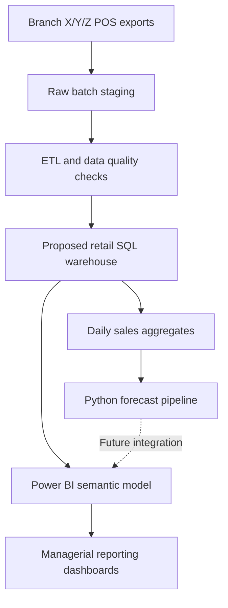

# BI architecture and dimensional model

## What was implemented

- Interactive Power BI dashboards: executive overview and product/customer reporting.
- Prototype **star schema** relationships in Power BI linking the retail sales table to five dimensions: Date, Branch, ProductLine, Payment, CustomerSegment.
- Prototype **snowflake schema** in Power BI adding lookup tables including City, Gender and CustomerType.
- Python daily-sales forecast and 14-day evaluation **outside** the Power BI model.

## Proposed deployment architecture — not implemented

The proposed ingestion stage would record batch IDs, timestamps, source row counts and source files for traceability. ETL would validate date formats, duplicate records, totals, and category names. These actions should not be described as a deployed, automated ETL system in a CV or interview.

## Fact and dimensions

**Proposed warehouse grain:** one row per source transaction record, with a surrogate key in a production FactSales table. Repeated source invoice numbers must not automatically be treated as duplicate transactions. The current prototype retains source descriptive fields in the central retail table; it is not proof of a fully physicalised star schema warehouse.

- **Fact (prototype):** `RetailStore Dataset` — measures include sales total, quantity, COGS, tax and rating; appropriate aggregations vary.
- **Dimensions (star):** `DimDate`, `DimBranch`, `DimProductLine`, `DimPayment`, `DimCustomerSegment`.
- **Additional snowflake lookups:** `DimCity`, `DimGender`, `DimCustomerType`.

**Semantics matter:** `gross income` in the supplied coursework file was identified as tax rather than net profit. Do not label it as company profit. Ratings should be averaged, not summed.

## Star versus snowflake: design trade-off

For this 1,000-row dataset, a star is preferable for clear BI authoring and simple dimension filtering. Snowflaking separates small shared lookups but adds relationships without substantial analytical benefit here. This recommendation is a model-usability judgement; neither performance gains nor reductions in storage were benchmarked.

## Known gaps

The project does not provide a deployed relational warehouse, POS integration, production ETL scheduling, row-level security, cloud hosting, or Power BI-integrated forecast data. Each would be a valid future extension.
